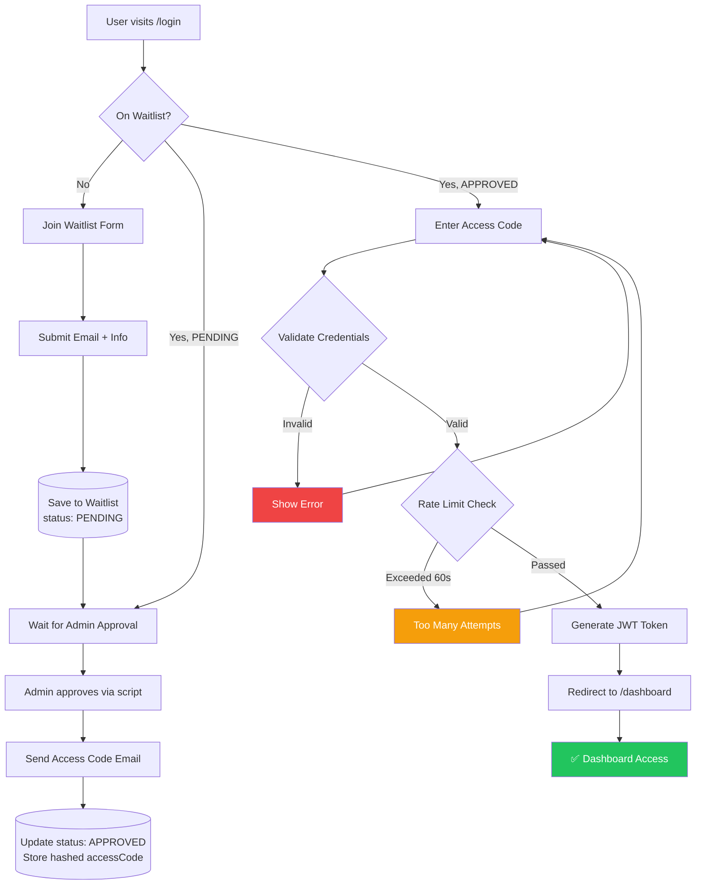
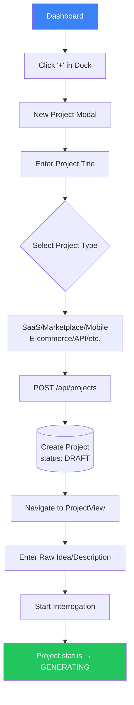
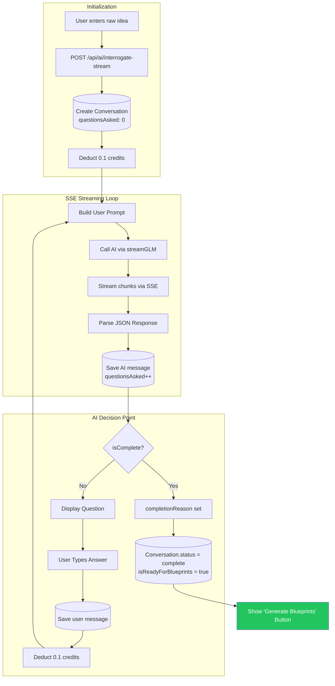
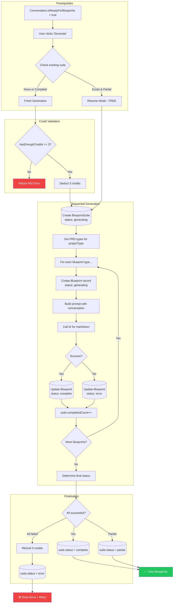
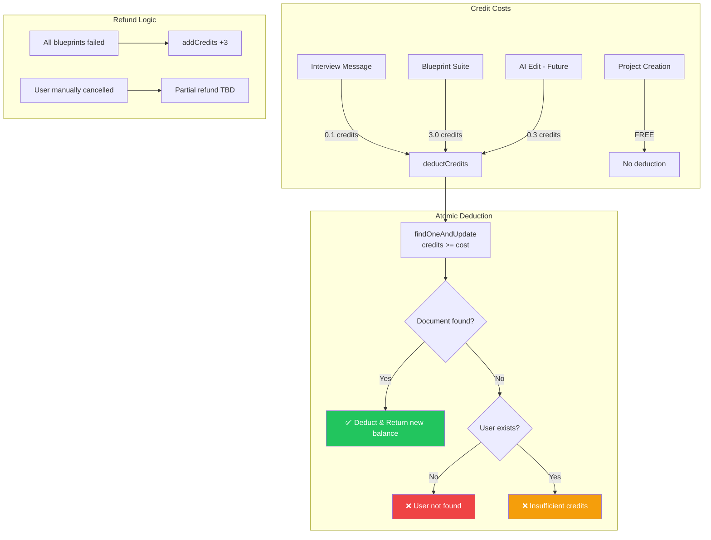
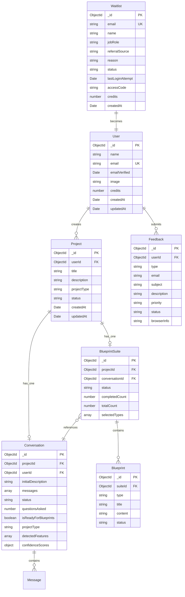

# The Architect - Technical Architecture Documentation

> A comprehensive technical reference and onboarding guide for "The Architect" - an AI-powered PRD generator that transforms raw ideas into production-ready blueprints.

---

## Table of Contents

1. [Project Overview](#1-project-overview)
2. [System Architecture](#2-system-architecture)
3. [User Journeys](#3-user-journeys)
   - [Authentication Flow](#31-authentication-flow)
   - [Project Creation Journey](#32-project-creation-journey)
   - [Deep-Dive Interrogation Flow](#33-deep-dive-interrogation-flow)
   - [Blueprint Suite Generation](#34-blueprint-suite-generation)
   - [Credit System Flow](#35-credit-system-flow)
4. [Database Entity Relationships](#4-database-entity-relationships)
5. [Data Flow Visualization](#5-data-flow-visualization)
6. [API Reference](#6-api-reference)

---

## 1. Project Overview

**The Architect** is an AI-powered SaaS application that transforms vague product ideas into comprehensive, production-ready PRD (Product Requirements Document) suites. It uses a "Deep-Dive Interrogation" process to extract detailed requirements through strategic questioning, then generates a complete Blueprint Suite of 6 technical documents.

### Core Value Proposition

```
┌─────────────────────────────────────────────────────────────────────────────┐
│                         THE ARCHITECT WORKFLOW                              │
├─────────────────────────────────────────────────────────────────────────────┤
│                                                                             │
│   🌱 Raw Idea ──► 🔍 AI Interrogation ──► 📋 Blueprint Suite               │
│                     (10-30 questions)        (6 PRD Documents)              │
│                                                                             │
│   "I want to build     "Who are your      • Design System PRD              │
│    a marketplace        target users?"     • Frontend Architecture          │
│    for artists"        "What payment       • Backend Architecture           │
│                         methods?"          • Database Schema                │
│                        "Any AI features?"  • Security PRD                   │
│                                            • MVP Feature List               │
└─────────────────────────────────────────────────────────────────────────────┘
```

### Tech Stack

| Layer      | Technology                        |
|------------|-----------------------------------|
| Frontend   | Next.js 14, React, TypeScript     |
| State      | Zustand                           |
| Styling    | Tailwind CSS, Shadcn/ui           |
| Backend    | Next.js API Routes (App Router)   |
| Database   | MongoDB (Mongoose ODM)            |
| Auth       | NextAuth.js (Credentials + JWT)   |
| AI Engine  | OpenRouter API (GLM-4.5-Air)      |
| Streaming  | Server-Sent Events (SSE)          |

---

## 2. System Architecture

### High-Level Architecture

```
┌───────────────────────────────────────────────────────────────────────────────┐
│                              CLIENT LAYER                                     │
│  ┌────────────┐   ┌────────────┐   ┌────────────┐   ┌────────────┐           │
│  │  Landing   │   │  Dashboard │   │  Project   │   │  Blueprint │           │
│  │   Page     │   │   (Dock)   │   │   View     │   │   Viewer   │           │
│  └─────┬──────┘   └─────┬──────┘   └─────┬──────┘   └─────┬──────┘           │
│        │                │                │                │                   │
│        └────────────────┴────────────────┴────────────────┘                   │
│                                   │                                           │
│                          Zustand Stores                                       │
│                    (Dashboard, Chat, Blueprint)                               │
└───────────────────────────────────────────────────────────────────────────────┘
                                    │
                                    │ HTTP / SSE
                                    ▼
┌───────────────────────────────────────────────────────────────────────────────┐
│                              API LAYER                                        │
│  ┌─────────────────┐  ┌─────────────────┐  ┌─────────────────┐               │
│  │   /api/auth/*   │  │  /api/projects  │  │    /api/ai/*    │               │
│  │  (NextAuth.js)  │  │   CRUD Ops      │  │  AI Operations  │               │
│  └────────┬────────┘  └────────┬────────┘  └────────┬────────┘               │
│           │                    │                    │                         │
│           └────────────────────┴────────────────────┘                         │
│                                │                                              │
│                    ┌───────────┴───────────┐                                  │
│                    │   Middleware Layer    │                                  │
│                    │  • Authentication     │                                  │
│                    │  • Credit Validation  │                                  │
│                    │  • Rate Limiting      │                                  │
│                    └───────────┬───────────┘                                  │
└───────────────────────────────────────────────────────────────────────────────┘
                                 │
              ┌──────────────────┼──────────────────┐
              ▼                  ▼                  ▼
┌─────────────────────┐  ┌──────────────┐  ┌──────────────────┐
│   MongoDB Atlas     │  │  OpenRouter  │  │   Email Service  │
│  ┌───────────────┐  │  │   AI API     │  │   (SMTP/Gmail)   │
│  │ • Users       │  │  │              │  │                  │
│  │ • Waitlist    │  │  │ GLM-4.5-Air  │  │  Transactional   │
│  │ • Projects    │  │  │   Model      │  │     Emails       │
│  │ • Conversations│ │  │              │  │                  │
│  │ • Blueprints  │  │  │  Key Rotation│  │                  │
│  │ • Feedback    │  │  │   (3 Keys)   │  │                  │
│  └───────────────┘  │  └──────────────┘  └──────────────────┘
└─────────────────────┘
```

### Directory Structure

```
apps/web/src/
├── app/                      # Next.js App Router
│   ├── api/                  # API Routes
│   │   ├── auth/             # NextAuth handlers
│   │   ├── ai/               # AI endpoints
│   │   │   ├── interrogate-stream/  # SSE chat
│   │   │   ├── generate-suite/      # PRD generation
│   │   │   ├── blueprints/          # Blueprint CRUD
│   │   │   ├── check-suite/         # Suite status
│   │   │   └── conversation/        # Chat state
│   │   ├── projects/         # Project CRUD
│   │   ├── user/             # User profile
│   │   ├── waitlist/         # Waitlist operations
│   │   └── feedback/         # Feedback submission
│   ├── dashboard/            # Protected dashboard
│   ├── login/                # Auth pages
│   └── (public)/             # Marketing pages
├── components/               # React components
├── features/                 # Feature modules
│   ├── auth/                 # Auth components
│   ├── dashboard/            # Dashboard UI
│   └── ai/                   # AI chat components
├── lib/                      # Core utilities
│   ├── ai/                   # AI client + prompts
│   │   ├── client.ts         # OpenRouter client
│   │   └── prompts/          # System prompts
│   ├── models.ts             # Mongoose schemas
│   ├── db.ts                 # DB connection
│   ├── credits.ts            # Credit system
│   └── types.ts              # TypeScript types
└── store/                    # Zustand stores
```

---

## 3. User Journeys

### 3.1 Authentication Flow

The authentication system uses a Waitlist-based access code model for beta testing.



**State Transitions:**

| State     | Trigger              | Next State |
|-----------|----------------------|------------|
| PENDING   | Admin approval       | APPROVED   |
| APPROVED  | First successful login | REDEEMED |
| REDEEMED  | (Terminal state)     | -          |

**Error States:**

- `401 Unauthorized`: Invalid access code
- `403 Forbidden`: Not on waitlist or not approved
- `429 Too Many Requests`: Rate limit exceeded (60s cooldown)

---

### 3.2 Project Creation Journey



**Project Types:**

```typescript
type ProjectType = 
  | "saas"         // Software as a Service
  | "marketplace"  // Two-sided marketplace
  | "mobile"       // Mobile application
  | "ecommerce"    // Online store
  | "internal"     // Internal tool
  | "api"          // API/Backend service
  | "ai-product"   // AI-powered product
  | "cli"          // Command-line tool
  | "iot"          // IoT application
  | "educational"; // Learning platform
```

---

### 3.3 Deep-Dive Interrogation Flow

The AI asks 10-30 strategic questions across 4 categories to extract complete requirements.



**SSE Event Types:**

```typescript
// Event: "start"
{ conversationId: string, questionsAsked: number }

// Event: "chunk" (streamed)
{ content: string }

// Event: "done"
{ 
  question: string,
  category: "users" | "problem" | "technical" | "scope",
  isComplete: boolean,
  completionReason?: string,
  questionsAsked: number 
}

// Event: "error"
{ error: string, message?: string, remainingCredits?: number }
```

**Question Categories:**

| Category  | Focus Area                                  |
|-----------|---------------------------------------------|
| users     | Target audience, personas, user needs       |
| problem   | Pain points, current solutions, gaps        |
| technical | Tech preferences, integrations, scale       |
| scope     | MVP features, timeline, budget constraints  |

---

### 3.4 Blueprint Suite Generation



**Blueprint Types by Project:**

| Project Type | Blueprint Documents |
|--------------|---------------------|
| saas         | design-system, frontend, backend, database, security, mvp-features |
| marketplace  | design-system, frontend, backend, database, security, mvp-features |
| mobile       | design-system, frontend, backend, database, security, mvp-features |
| api          | backend, database, security, mvp-features |
| cli          | backend, mvp-features |

---

### 3.5 Credit System Flow



**Credit Constants:**

```typescript
export const CREDIT_COSTS = {
    MESSAGE: 0.1,        // Per interview message
    BLUEPRINT_SUITE: 3,  // Full PRD generation
    AI_EDIT: 0.3,        // Per AI-assisted edit (future)
    PROJECT: 0,          // Free
} as const;

export const DEFAULT_CREDITS = 30; // Beta users
```

---

## 4. Database Entity Relationships

### Entity-Relationship Diagram




### ASCII Collection Overview

```
┌─────────────────────────────────────────────────────────────────────────────┐
│                           MONGODB COLLECTIONS                                │
├─────────────────────────────────────────────────────────────────────────────┤
│                                                                             │
│  ┌─────────────┐       ┌─────────────────┐       ┌──────────────────┐      │
│  │  Waitlist   │       │    Project      │       │  BlueprintSuite  │      │
│  │─────────────│       │─────────────────│       │──────────────────│      │
│  │ email (UK)  │       │ userId (FK,IDX) │──1:N──│ projectId (FK,UK)│      │
│  │ accessCode  │       │ projectType     │       │ conversationId   │      │
│  │ status      │       │ status          │       │ completedCount   │      │
│  │ credits: 30 │       │ createdAt (IDX) │       │ totalCount       │      │
│  └──────┬──────┘       └────────┬────────┘       └────────┬─────────┘      │
│         │                       │                         │                 │
│         ▼ (becomes)             │                         │ 1:N             │
│  ┌─────────────┐                │                         ▼                 │
│  │    User     │                │                  ┌──────────────┐         │
│  │─────────────│                │                  │  Blueprint   │         │
│  │ email (UK)  │                │                  │──────────────│         │
│  │ credits: 30 │                │                  │ suiteId (IDX)│         │
│  │ createdAt   │                │                  │ type         │         │
│  └──────┬──────┘                │                  │ content (MD) │         │
│         │                       │                  │ status       │         │
│         │ 1:N                   │ 1:1              └──────────────┘         │
│         ▼                       ▼                                           │
│  ┌─────────────┐       ┌─────────────────┐                                  │
│  │  Feedback   │       │  Conversation   │                                  │
│  │─────────────│       │─────────────────│                                  │
│  │ userId (IDX)│       │ projectId (FK)  │                                  │
│  │ type        │       │ userId (IDX)    │                                  │
│  │ priority    │       │ messages[]      │ ◄─── Embedded Documents          │
│  │ status      │       │ questionsAsked  │                                  │
│  └─────────────┘       │ confidenceScores│                                  │
│                        └─────────────────┘                                  │
│                                                                             │
└─────────────────────────────────────────────────────────────────────────────┘
```

### Collection Details

#### 1. User Collection

```typescript
const UserSchema = new Schema({
    name: String,
    email: { type: String, unique: true },      // Unique index
    emailVerified: Date,
    image: String,
    credits: { type: Number, default: 30 },     // Beta credits
    createdAt: { type: Date, default: Date.now },
    updatedAt: { type: Date, default: Date.now },
});
```

| Field         | Type    | Required | Index  | Notes                    |
|---------------|---------|----------|--------|--------------------------|
| _id           | ObjectId| Auto     | PK     | Primary key              |
| name          | String  | No       | -      | Display name             |
| email         | String  | No       | Unique | OAuth email              |
| emailVerified | Date    | No       | -      | NextAuth field           |
| image         | String  | No       | -      | Profile picture URL      |
| credits       | Number  | No       | -      | Default: 30              |

---

#### 2. Waitlist Collection

```typescript
const WaitlistSchema = new Schema({
    email: { type: String, required: true, unique: true },
    name: { type: String },
    jobRole: { type: String },
    referralSource: { type: String },
    reason: { type: String },
    status: {
        type: String,
        enum: ["PENDING", "APPROVED", "REDEEMED"],
        default: "PENDING"
    },
    createdAt: { type: Date, default: Date.now },
    lastLoginAttempt: { type: Date },
    accessCode: { type: String },  // bcrypt hashed
    credits: { type: Number, default: 30 },
});
```

| Field            | Type   | Required | Index  | Notes                         |
|------------------|--------|----------|--------|-------------------------------|
| email            | String | Yes      | Unique | User identifier               |
| status           | Enum   | No       | -      | PENDING → APPROVED → REDEEMED |
| accessCode       | String | No       | -      | bcrypt hash (only for APPROVED)|
| credits          | Number | No       | -      | Credit balance                |
| lastLoginAttempt | Date   | No       | -      | Rate limiting                 |

---

#### 3. Project Collection

```typescript
const ProjectSchema = new Schema({
    userId: {
        type: mongoose.Schema.Types.ObjectId,
        ref: "User",
        required: true,
        index: true
    },
    title: { type: String, required: true },
    description: { type: String, default: "" },
    projectType: {
        type: String,
        enum: ["saas", "marketplace", "mobile", "ecommerce", 
               "internal", "api", "ai-product", "cli", "iot", "educational"],
        default: "saas"
    },
    status: {
        type: String,
        enum: ["DRAFT", "GENERATING", "COMPLETED", "AWAITING_ANSWERS"],
        default: "DRAFT"
    },
    createdAt: { type: Date, default: Date.now },
    updatedAt: { type: Date, default: Date.now },
});

// Compound index for dashboard queries
ProjectSchema.index({ userId: 1, createdAt: -1 });
```

| Field       | Type     | Required | Index                | Notes                   |
|-------------|----------|----------|----------------------|-------------------------|
| userId      | ObjectId | Yes      | Single + Compound    | Owner reference         |
| title       | String   | Yes      | -                    | Project name            |
| projectType | Enum     | No       | -                    | Determines PRD types    |
| status      | Enum     | No       | -                    | Workflow state          |

---

#### 4. Conversation Collection (Embedded Messages)

```typescript
const MessageSchema = new mongoose.Schema({
    role: {
        type: String,
        enum: ["user", "assistant"],
        required: true
    },
    content: { type: String, required: true },
    category: String,  // 'users' | 'problem' | 'technical' | 'scope'
}, { timestamps: true });

const ConversationSchema = new mongoose.Schema({
    projectId: { type: ObjectId, ref: "Project", required: true },
    userId: { type: ObjectId, ref: "User", required: true, index: true },
    initialDescription: { type: String, required: true },
    messages: [MessageSchema],  // EMBEDDED DOCUMENTS
    status: {
        type: String,
        enum: ["in_progress", "complete", "abandoned"],
        default: "in_progress",
    },
    questionsAsked: { type: Number, default: 0 },
    isReadyForBlueprints: { type: Boolean, default: false },
    projectType: { type: String, enum: [...projectTypes, null], default: null },
    detectedFeatures: [{ type: String, enum: [...featureFlags] }],
    confidenceScores: {
        users: { type: Number, default: 0 },
        problem: { type: Number, default: 0 },
        technical: { type: Number, default: 0 },
        scope: { type: Number, default: 0 }
    }
}, { timestamps: true });

// Compound index for ownership queries
ConversationSchema.index({ userId: 1, projectId: 1 });
```

> **Design Decision: Embedded Messages**  
> Messages are embedded within Conversation documents (not referenced) because:
> - Messages are always accessed together with their conversation
> - Avoids N+1 query problem
> - Typical conversation has 20-60 messages (well under 16MB limit)

---

#### 5. BlueprintSuite Collection

```typescript
const BlueprintSuiteSchema = new mongoose.Schema({
    projectId: {
        type: ObjectId,
        ref: "Project",
        required: true,
        unique: true,  // ONE suite per project
        index: true,
    },
    conversationId: { type: ObjectId, ref: "Conversation", required: true },
    status: {
        type: String,
        enum: ["generating", "complete", "partial", "error"],
        default: "generating",
    },
    completedCount: { type: Number, default: 0 },
    totalCount: { type: Number, default: 6 },
    selectedTypes: [{ type: String }],
}, { timestamps: true });
```

| Field          | Type     | Required | Index  | Notes                           |
|----------------|----------|----------|--------|---------------------------------|
| projectId      | ObjectId | Yes      | Unique | One-to-one with Project         |
| completedCount | Number   | No       | -      | Progress tracking               |
| totalCount     | Number   | No       | -      | Dynamic based on projectType    |
| selectedTypes  | [String] | No       | -      | Which blueprints were generated |

---

#### 6. Blueprint Collection

```typescript
const BlueprintSchema = new mongoose.Schema({
    suiteId: {
        type: ObjectId,
        ref: "BlueprintSuite",
        required: true,
        index: true,
    },
    type: { type: String, required: true },  // Dynamic, no enum restriction
    title: { type: String, required: true },
    content: { type: String, default: "" },  // Markdown content
    status: {
        type: String,
        enum: ["pending", "generating", "complete", "error"],
        default: "pending",
    },
}, { timestamps: true });
```

| Field   | Type     | Required | Index | Notes                    |
|---------|----------|----------|-------|--------------------------|
| suiteId | ObjectId | Yes      | Yes   | Parent suite reference   |
| type    | String   | Yes      | -     | Blueprint document type  |
| content | String   | No       | -     | Full markdown document   |
| status  | Enum     | No       | -     | Individual status        |

---

#### 7. Feedback Collection

```typescript
const FeedbackSchema = new mongoose.Schema({
    type: {
        type: String,
        enum: ["feedback", "feature", "bug"],
        required: true,
    },
    email: { type: String, required: true },
    subject: { type: String, required: true, maxlength: 200 },
    description: { type: String, required: true, maxlength: 2000 },
    priority: {
        type: String,
        enum: ["low", "medium", "high", "critical"],
        default: "medium",
    },
    userId: { type: ObjectId, ref: "User", index: true },
    status: {
        type: String,
        enum: ["pending", "reviewed", "resolved"],
        default: "pending",
    },
    browserInfo: { type: String },
}, { timestamps: true });

// Admin query index
FeedbackSchema.index({ status: 1, createdAt: -1 });
```

---

### Index Strategy

| Collection      | Index                        | Type       | Purpose                      |
|-----------------|------------------------------|------------|------------------------------|
| User            | email                        | Unique     | Auth lookups                 |
| Waitlist        | email                        | Unique     | Auth lookups                 |
| Project         | userId                       | Single     | User's projects              |
| Project         | { userId: 1, createdAt: -1 } | Compound   | Dashboard sorted listing     |
| Conversation    | userId                       | Single     | Security validation          |
| Conversation    | { userId: 1, projectId: 1 }  | Compound   | Ownership check              |
| BlueprintSuite  | projectId                    | Unique     | One suite per project        |
| Blueprint       | suiteId                      | Single     | Suite's blueprints           |
| Feedback        | userId                       | Single     | User's feedback              |
| Feedback        | { status: 1, createdAt: -1 } | Compound   | Admin review queue           |

---

## 5. Data Flow Visualization

### Request/Response Cycle

```
┌─────────────────────────────────────────────────────────────────────────────┐
│                         API REQUEST LIFECYCLE                                │
├─────────────────────────────────────────────────────────────────────────────┤
│                                                                             │
│  1. CLIENT REQUEST                                                          │
│     ┌──────────────────────────────────────────────────────────────┐       │
│     │ fetch('/api/ai/interrogate-stream', {                        │       │
│     │   method: 'POST',                                            │       │
│     │   body: JSON.stringify({ conversationId, userMessage })      │       │
│     │ })                                                           │       │
│     └──────────────────────────────────────────────────────────────┘       │
│                                    │                                        │
│                                    ▼                                        │
│  2. AUTHENTICATION (auth())                                                 │
│     ┌──────────────────────────────────────────────────────────────┐       │
│     │ session = await auth();                                      │       │
│     │ if (!session?.user?.id) return 401;                          │       │
│     └──────────────────────────────────────────────────────────────┘       │
│                                    │                                        │
│                                    ▼                                        │
│  3. OWNERSHIP VALIDATION                                                    │
│     ┌──────────────────────────────────────────────────────────────┐       │
│     │ conversation = await Conversation.findOne({                  │       │
│     │   _id: conversationId,                                       │       │
│     │   userId: session.user.id  // CRITICAL: Security             │       │
│     │ });                                                          │       │
│     └──────────────────────────────────────────────────────────────┘       │
│                                    │                                        │
│                                    ▼                                        │
│  4. CREDIT VALIDATION                                                       │
│     ┌──────────────────────────────────────────────────────────────┐       │
│     │ const result = await deductCredits(                          │       │
│     │   session.user.email,                                        │       │
│     │   CREDIT_COSTS.MESSAGE,  // 0.1                              │       │
│     │   "interview_message"                                        │       │
│     │ );                                                           │       │
│     │ if (!result.success) return 402;                             │       │
│     └──────────────────────────────────────────────────────────────┘       │
│                                    │                                        │
│                                    ▼                                        │
│  5. BUSINESS LOGIC (AI Call)                                                │
│     ┌──────────────────────────────────────────────────────────────┐       │
│     │ for await (const chunk of streamGLM(systemPrompt, userPrompt))│      │
│     │   controller.enqueue(formatSSE("chunk", { content: chunk })) │       │
│     └──────────────────────────────────────────────────────────────┘       │
│                                    │                                        │
│                                    ▼                                        │
│  6. DATABASE PERSISTENCE                                                    │
│     ┌──────────────────────────────────────────────────────────────┐       │
│     │ conversation.messages.push({ role: "assistant", content });  │       │
│     │ conversation.questionsAsked += 1;                            │       │
│     │ await conversation.save();                                   │       │
│     └──────────────────────────────────────────────────────────────┘       │
│                                    │                                        │
│                                    ▼                                        │
│  7. STREAM RESPONSE                                                         │
│     ┌──────────────────────────────────────────────────────────────┐       │
│     │ event: done                                                  │       │
│     │ data: {"question":"...","category":"technical",...}          │       │
│     └──────────────────────────────────────────────────────────────┘       │
│                                                                             │
└─────────────────────────────────────────────────────────────────────────────┘
```

### SSE Streaming Architecture

```
┌─────────────┐          ┌─────────────────────┐          ┌──────────────┐
│   Client    │          │    API Route        │          │  OpenRouter  │
│  (Browser)  │          │ (interrogate-stream)│          │     API      │
└──────┬──────┘          └──────────┬──────────┘          └──────┬───────┘
       │                            │                            │
       │ POST /api/ai/interrogate-stream                         │
       │ EventSource connection     │                            │
       │──────────────────────────>│                            │
       │                            │                            │
       │                            │    streamGLM(prompt)       │
       │                            │──────────────────────────>│
       │                            │                            │
       │  event: start              │                            │
       │  data: {conversationId}    │                            │
       │<──────────────────────────│                            │
       │                            │                            │
       │                            │    chunk: "What"           │
       │  event: chunk              │<──────────────────────────│
       │  data: {content: "What"}   │                            │
       │<──────────────────────────│                            │
       │                            │    chunk: " is..."         │
       │  event: chunk              │<──────────────────────────│
       │  data: {content: " is..."}│                            │
       │<──────────────────────────│                            │
       │         ...                │         ...                │
       │                            │    [stream complete]       │
       │                            │<──────────────────────────│
       │                            │                            │
       │                            │    Save to MongoDB         │
       │                            │──────┐                     │
       │                            │<─────┘                     │
       │                            │                            │
       │  event: done               │                            │
       │  data: {question,category} │                            │
       │<──────────────────────────│                            │
       │                            │                            │
       ▼                            ▼                            ▼
```

### State Management (Zustand ↔ API ↔ Database)

```
┌─────────────────────────────────────────────────────────────────────────────┐
│                      ZUSTAND STORE ARCHITECTURE                              │
├─────────────────────────────────────────────────────────────────────────────┤
│                                                                             │
│  ┌────────────────────┐    ┌────────────────────┐    ┌──────────────────┐  │
│  │  useDashboardStore │    │    useChatStore    │    │ useBlueprintStore│  │
│  ├────────────────────┤    ├────────────────────┤    ├──────────────────┤  │
│  │ • projects[]       │    │ • messages[]       │    │ • blueprints[]   │  │
│  │ • selectedProject  │    │ • conversationId   │    │ • selectedType   │  │
│  │ • isLoading        │    │ • isStreaming      │    │ • suiteStatus    │  │
│  │ • fetchProjects()  │    │ • streamingContent │    │ • fetchSuite()   │  │
│  │ • createProject()  │    │ • sendMessage()    │    │ • generate()     │  │
│  │ • deleteProject()  │    │ • startStream()    │    │                  │  │
│  └─────────┬──────────┘    └─────────┬──────────┘    └────────┬─────────┘  │
│            │                         │                        │            │
│            ▼                         ▼                        ▼            │
│  ┌─────────────────────────────────────────────────────────────────────┐   │
│  │                         API Layer (fetch)                           │   │
│  └─────────────────────────────────────────────────────────────────────┘   │
│            │                         │                        │            │
│            ▼                         ▼                        ▼            │
│  ┌─────────────────┐    ┌─────────────────────┐    ┌──────────────────┐   │
│  │ /api/projects   │    │/api/ai/interrogate- │    │/api/ai/generate- │   │
│  │                 │    │      stream         │    │      suite       │   │
│  └────────┬────────┘    └──────────┬──────────┘    └────────┬─────────┘   │
│           │                        │                        │              │
│           ▼                        ▼                        ▼              │
│  ┌─────────────────────────────────────────────────────────────────────┐   │
│  │                         MongoDB (Mongoose)                          │   │
│  │    Project           Conversation              BlueprintSuite       │   │
│  └─────────────────────────────────────────────────────────────────────┘   │
│                                                                             │
└─────────────────────────────────────────────────────────────────────────────┘
```

---

## 6. API Reference

### Authentication Endpoints

| Method | Endpoint              | Description            | Auth Required |
|--------|----------------------|------------------------|---------------|
| POST   | /api/auth/signin     | NextAuth sign in       | No            |
| POST   | /api/auth/signout    | NextAuth sign out      | Yes           |
| GET    | /api/auth/session    | Get current session    | No            |

### Project Endpoints

| Method | Endpoint              | Description            | Auth Required |
|--------|----------------------|------------------------|---------------|
| GET    | /api/projects        | List user's projects   | Yes           |
| POST   | /api/projects        | Create new project     | Yes           |
| GET    | /api/projects/[id]   | Get project details    | Yes           |
| PATCH  | /api/projects/[id]   | Update project         | Yes           |
| DELETE | /api/projects/[id]   | Delete project         | Yes           |

### AI Endpoints

| Method | Endpoint                    | Description              | Auth | Credits |
|--------|-----------------------------|--------------------------|------|---------|
| POST   | /api/ai/interrogate-stream  | SSE streaming chat       | Yes  | 0.1/msg |
| GET    | /api/ai/conversation        | Get conversation state   | Yes  | Free    |
| POST   | /api/ai/generate-suite      | Generate blueprint suite | Yes  | 3.0     |
| GET    | /api/ai/check-suite         | Check suite status       | Yes  | Free    |
| GET    | /api/ai/blueprints          | Get all blueprints       | Yes  | Free    |

### Utility Endpoints

| Method | Endpoint              | Description            | Auth Required |
|--------|----------------------|------------------------|---------------|
| GET    | /api/user            | Get user profile       | Yes           |
| POST   | /api/waitlist        | Join waitlist          | No            |
| POST   | /api/feedback        | Submit feedback        | Optional      |

---

## Appendix: Quick Reference

### Status Enums

```typescript
// Project Status
type ProjectStatus = "DRAFT" | "GENERATING" | "COMPLETED" | "AWAITING_ANSWERS";

// Conversation Status  
type ConversationStatus = "in_progress" | "complete" | "abandoned";

// Blueprint Status
type BlueprintStatus = "pending" | "generating" | "complete" | "error";

// BlueprintSuite Status
type BlueprintSuiteStatus = "generating" | "complete" | "partial" | "error";

// Waitlist Status
type WaitlistStatus = "PENDING" | "APPROVED" | "REDEEMED";

// Feedback Type
type FeedbackType = "feedback" | "feature" | "bug";
```

### Environment Variables

```bash
# Database
MONGODB_URI=mongodb+srv://...

# Auth
NEXTAUTH_SECRET=...
NEXTAUTH_URL=https://your-domain.com

# AI (Key Rotation)
OPENROUTER_API_KEY_1=sk-or-v1-...
OPENROUTER_API_KEY_2=sk-or-v1-...
OPENROUTER_API_KEY_3=sk-or-v1-...

# Email
EMAIL_HOST=smtp.gmail.com
EMAIL_PORT=587
EMAIL_USER=your-email@gmail.com
EMAIL_PASS=app-specific-password
```

---

*Last Updated: December 2024*  
*Version: 1.2.0*
